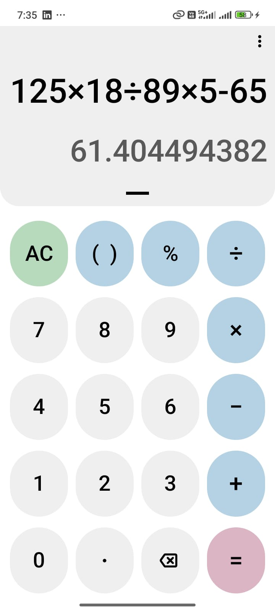
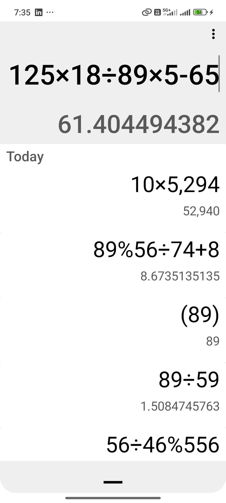

# Simple Calculator App

A minimal Android calculator app built using Kotlin.  
This version includes only the basic **calculator** and **history** features.

## Features
- Basic arithmetic calculations
- Expression parsing
- Calculation history (view & reuse previous results)
- Lightweight and clean project structure

## Installation

Clone the repository:

```bash
git clone https://github.com/umamule/SimpleCalculator.git
```
Project Structure

app/src/main/java/
 ├── activities/MainActivity.kt
 ├── calculator/
 │     ├── Calculator.kt
 │     └── parser/
 │           ├── Expression.kt
 │           └── NumberFormatter.kt
 └── history/  
       ├── History.kt
       └── HistoryAdapter.kt          


Requirements

Android Studio

Kotlin

Minimum SDK: 21

## Screenshots

### Calculator Screen




### History Screen





